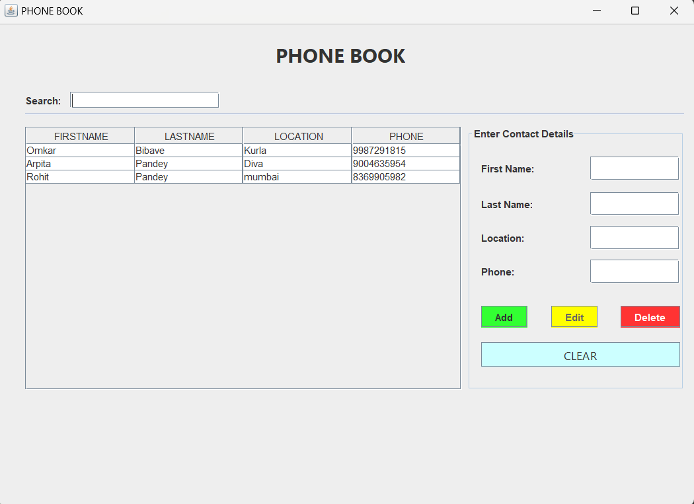

# Phonebook Application

A simple Phonebook application built using Java and MySQL, designed to store, manage, and modify contact details efficiently.

## Features

- Add, edit, delete, and search contacts.
- Store contact details like name, phone number, email, and address.
- Use MySQL as a backend database for persistent storage.
- GUI-based interface (if applicable).

---

## Prerequisites

### Software Requirements

- **Java Development Kit (JDK) 8 or later**
- **Eclipse IDE** (or any preferred Java IDE)
- **MySQL Database Server**
- **JDBC Driver for MySQL**

## Setting up Eclipse for Java Development

1. **Download and Install Eclipse IDE**:
   - Get Eclipse from [Eclipse Downloads](https://www.eclipse.org/downloads/).
   - Install and launch Eclipse.
2. **Configure JDK in Eclipse**:
   - Go to `Window` → `Preferences` → `Java` → `Installed JREs`.
   - Click `Add...` and select the installed JDK.
   - Set it as the default JRE.
3. **Create a New Java Project**:
   - Open Eclipse and select `File` → `New` → `Java Project`.
   - Provide a project name (e.g., `PhonebookApp`).
   - Click `Finish`.
4. **Add MySQL Connector (JDBC)**:
   - Download the MySQL JDBC driver from [MySQL Connector/J](https://dev.mysql.com/downloads/connector/j/).
   - Right-click on your project → `Build Path` → `Add External JARs`.
   - Select the downloaded `mysql-connector-java-xx.xx.xx.jar` file and click `Apply and Close`.

---

## Database Setup (MySQL)

1. **Create a new database**:
   ```sql
   CREATE DATABASE phonebook_db;
   ```
2. **Create the contacts table**:
   ```sql
   CREATE TABLE contacts (
       id INT AUTO_INCREMENT PRIMARY KEY,
       name VARCHAR(100) NOT NULL,
       phone_number VARCHAR(15) NOT NULL,
       email VARCHAR(100),
       address TEXT
   );
   ```
3. **Insert sample data**:
   ```sql
   INSERT INTO contacts (name, phone_number, email, address) VALUES
   ('John Doe', '123-456-7890', 'john@example.com', '123 Main St');
   ```

---

## Functionality

### 1. Display Contacts

- Retrieves and displays all stored contacts from the database.
- Query example:
  ```sql
  SELECT * FROM contacts;
  ```

### 2. Add a New Contact

- Allows users to add a new contact.
- Query example:
  ```sql
  INSERT INTO contacts (name, phone_number, email, address) VALUES ('Alice Brown', '987-654-3210', 'alice@example.com', '456 Elm St');
  ```

### 3. Update Contact Information

- Allows modification of existing contact details.
- Query example:
  ```sql
  UPDATE contacts SET phone_number='111-222-3333' WHERE name='John Doe';
  ```

### 4. Delete a Contact

- Enables deletion of a contact by ID or name.
- Query example:
  ```sql
  DELETE FROM contacts WHERE name='Omkar';
  ```

### 5. Search Contacts

- Search for contacts based on name or phone number.
- Query example:
  ```sql
  SELECT * FROM contacts WHERE name LIKE '%John%';
  ```

---

## Running the Application

1. **Compile the Java Program**:
   - If using Eclipse, right-click the project and select `Run As` → `Java Application`.
   - If using the command line:
     ```sh
     javac Phonebook.java
     java Phonebook
     ```
2. **Connect to MySQL Database**:
   - Ensure MySQL is running.
   - Update database credentials in the Java file:
     ```java
     Connection con = DriverManager.getConnection("jdbc:mysql://localhost:3306/phonebook_db", "root", "password");
     ```

---

## Future Enhancements

- Implement a graphical user interface (GUI) using JavaFX or Swing.
- Enable contact import/export functionality.
- Add user authentication for secure access.

---

## License

This project is open-source and free to use for educational purposes.

---

## Contributors

- **Rohit Pandey** (Developer)
- **Contributions are welcome!** Feel free to open an issue or submit a pull request.

Happy Coding! 🚀

